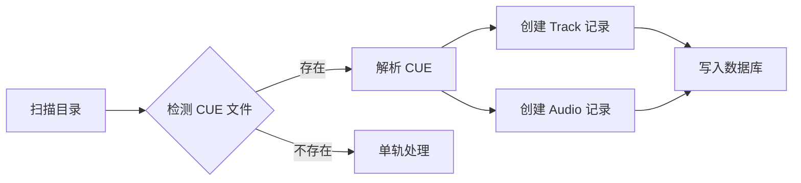
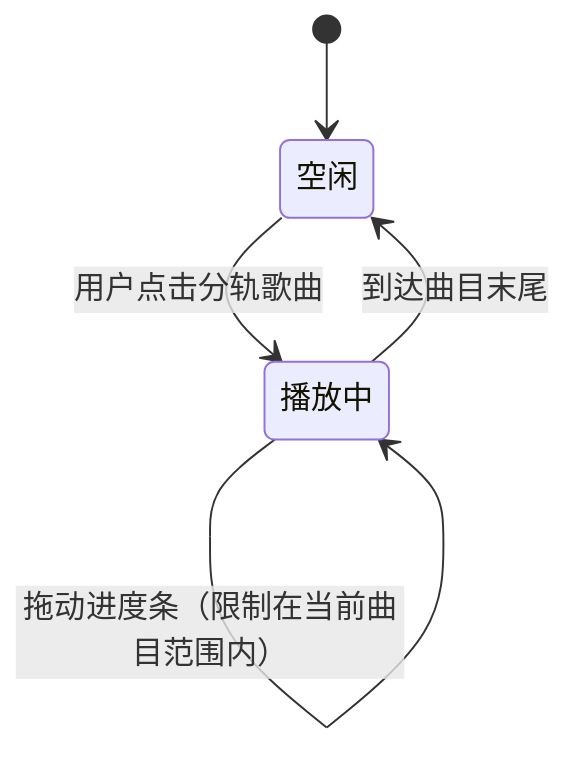
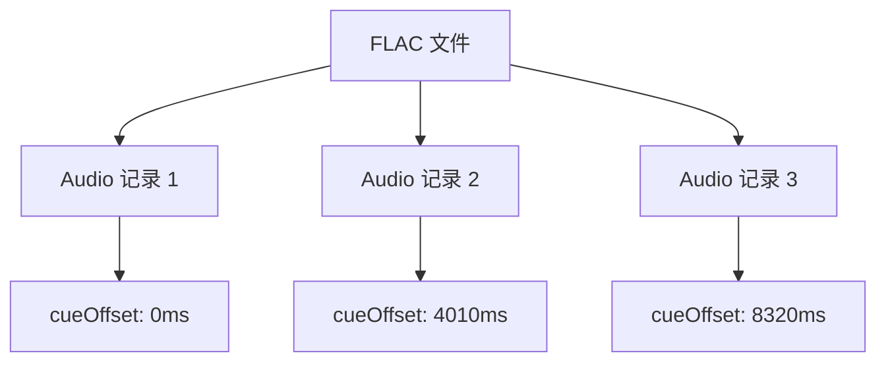

# CUE 分轨支持

> 技术设计见 [design.md](./design.md)，实现记录见 [dev.md](./dev.md)。

## 1. 文档信息

| 字段     | 内容             |
| -------- | ---------------- |
| 功能名称 | CUE 分轨支持     |
| 版本     | v3.0+            |
| 状态     | 已实施           |
| 负责人   | stark81          |
| 优先级   | P2（小众但关键） |

## 2. 背景与问题

### 用户场景

CD 翻录用户通常会得到两个文件：

- 一个完整的 FLAC/WAV 音频文件（整张 CD）
- 一个 CUE 索引文件（记录每首歌的起止位置）

```
示例 CUE 文件（RIP-CD 格式）：
  ┌──────────────────────────────────────┐
  │ PERFORMER "周杰伦"                    │
  │ TITLE "范特西"                        │
  │ FILE "范特西.flac" WAVE               │
  │   TRACK 01 AUDIO                     │
  │     TITLE "爱在西元前"                 │
  │     INDEX 01 00:00:00                │
  │   TRACK 02 AUDIO                     │
  │     TITLE "爸，我回来了"               │
  │     INDEX 01 04:01:00                │
  │   TRACK 03 AUDIO                     │
  │     TITLE "简单爱"                    │
  │     INDEX 01 08:32:00                │
  └──────────────────────────────────────┘
```

**当前问题**：VutronMusic 只能播放整轨，用户无法按歌曲跳转播放。

### 为什么要做

| 支持的理由                   | 不支持的代价                     |
| ---------------------------- | -------------------------------- |
| 音乐收藏家的核心需求         | 用户只能整轨播放，无法按歌曲跳转 |
| CD 翻录的标准化格式          | 需要其他工具拆分成单独文件       |
| 减少存储空间占用（不拆文件） | 不支持则失去一部分核心用户       |

**结论**：CUE 分轨是「小众但关键」的功能。用户量不大，但对目标用户群体（本地音乐收藏家）来说是 Make-or-Break 的功能。

## 3. 用户故事

### 角色定义

| 角色           | 描述                                        |
| -------------- | ------------------------------------------- |
| CD 翻录用户    | 拥有大量 CD 翻录的 FLAC 文件，附带 CUE 索引 |
| 本地音乐收藏家 | 管理数千首本地音乐，追求无损音质            |

### 用户故事

| # | 故事 | 价值 |
| --- | --- | --- |
| US-1 | 作为 CD 翻录用户，我希望扫描本地目录时自动识别 CUE 文件，以便我不需要手动拆分音频 | 节省时间，无需额外工具 |
| US-2 | 作为本地音乐收藏家，我希望每首分轨歌曲在界面中独立展示，以便我可以按歌曲浏览和播放 | 自然的浏览体验 |
| US-3 | 作为 CD 翻录用户，我希望播放分轨歌曲时进度条只显示该曲的范围，以便我可以精确控制播放位置 | 播放体验与独立文件一致 |
| US-4 | 作为本地音乐收藏家，我希望分轨歌曲支持拖动进度条，以便我可以快速跳转到歌曲任意位置 | 完整的播放控制 |

## 4. 功能需求

### 4.1 扫描与解析

| 需求 ID | 需求                                          | 优先级 |
| ------- | --------------------------------------------- | ------ |
| FR-1    | 扫描本地目录时，自动检测同名 CUE 文件         | P0     |
| FR-2    | 解析 CUE 文件，提取歌手、标题、曲目、起始时间 | P0     |
| FR-3    | 为每个曲目创建独立的歌曲记录，关联到同一专辑  | P0     |
| FR-4    | 为每个曲目创建音频记录，包含起始偏移和时长    | P0     |
| FR-5    | 检测 CUE 文件内容变化时，自动重新解析         | P1     |

### 4.2 播放支持

| 需求 ID | 需求                                         | 优先级 |
| ------- | -------------------------------------------- | ------ |
| FR-6    | 播放时从曲目的起始位置开始播放               | P0     |
| FR-7    | 进度条范围等于当前曲目时长，而非整个音频文件 | P0     |
| FR-8    | 拖动进度条时，定位范围限制在当前曲目内       | P0     |
| FR-9    | 播放到曲目末尾时自动停止或跳转下一首         | P1     |

### 4.3 数据存储

| 需求 ID | 需求                             | 优先级 |
| ------- | -------------------------------- | ------ |
| FR-10   | 音频记录支持起始偏移和时长字段   | P0     |
| FR-11   | 同一文件的不同曲目通过偏移量区分 | P0     |
| FR-12   | 多个曲目共享同一文件路径         | P0     |

## 5. 验收标准

### 5.1 扫描与解析



Given 用户配置了包含 CUE 文件的本地目录 When 触发音乐扫描 Then 系统应该：

- 识别同名 CUE 文件（如 "范特西.flac" + "范特西.cue"）
- 解析出每个曲目的标题、歌手、起始时间
- 为每个曲目创建独立的歌曲记录
- 为每个曲目创建音频记录，起始偏移等于 CUE 中定义的时间

### 5.2 播放支持



Given 用户点击一首分轨歌曲 When 播放开始 Then 系统应该：

- 从该曲目的起始位置开始播放
- 进度条显示范围为 [0, 曲目时长]
- 拖动进度条只能在 [0, 曲目时长] 范围内

### 5.3 数据一致性



Given 同一 FLAC 文件有 3 个分轨 When 查看音频记录 Then 应该有 3 条记录：

- 文件路径相同
- 起始偏移分别为 0ms、4010ms、8320ms
- 时长分别为 4010ms、4310ms、剩余时长

## 6. 不做范围

| 排除项              | 理由                                 |
| ------------------- | ------------------------------------ |
| CUE 文件编辑功能    | 超出播放器职责，用户可用专业工具     |
| 自动拆分音频文件    | 与"不拆文件"的设计理念冲突           |
| INDEX 00 支持       | INDEX 00 是 pregap，实际场景极少使用 |
| 多 CUE 文件合并     | 复杂度过高，且场景罕见               |
| 从网络下载 CUE 文件 | 超出本地播放器范围                   |

## 7. 成功指标

| 指标           | 目标        | 衡量方式                             |
| -------------- | ----------- | ------------------------------------ |
| CUE 文件识别率 | >95%        | 扫描含 CUE 的目录，识别成功率        |
| 分轨播放准确率 | 100%        | 分轨歌曲播放位置与 CUE 定义一致      |
| 进度条精度     | 误差 <100ms | 拖动进度条后实际播放位置             |
| 用户反馈       | 无负面反馈  | GitHub Issues 中无 CUE 相关 bug 报告 |
