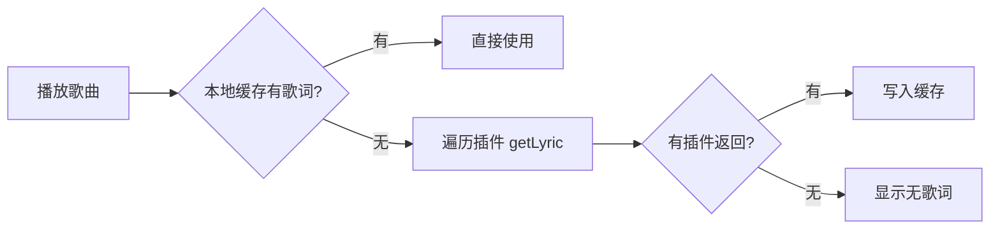

# 歌词系统

> 技术设计见 [design.md](./design.md)，实现记录见 [dev.md](./dev.md)。

## 功能概述

在播放音乐时自动匹配并展示歌词，支持逐行高亮和逐字高亮两种模式。

## 用户故事

| # | 角色 | 故事 | 价值 |
| --- | --- | --- | --- |
| US-1 | 听歌用户 | 作为听歌用户，我希望播放音乐时自动显示歌词，以便我可以跟唱或理解歌词内容 | 增强听歌体验 |
| US-2 | 多语言用户 | 作为多语言用户，我希望歌词支持翻译和罗马音，以便我可以理解外语歌曲 | 跨语言理解 |
| US-3 | 节奏感强的用户 | 作为节奏感强的用户，我希望看到逐字高亮，以便我可以精准跟上每个字的节奏 | 精准跟唱 |
| US-4 | 歌词不准的用户 | 作为歌词不准的用户，我希望可以手动调节歌词偏移，以便我可以校准歌词与音乐的同步 | 个性化校准 |

## 歌词格式

歌词文本由主进程统一解析为 `LyricLine[]` 后传递给渲染进程，渲染进程不关心原始格式。

| 格式 | 检测特征 | 说明 |
| --- | --- | --- |
| YRC | `(\d+,\d+,\d+)` | 网易云逐字格式，`(startMs,durationMs,xxx)word` |
| WRC | `[\d{2}:\d{2}\.\d{2,3}]` 在 content 中 | 逐字格式，`[MM:SS.ms]word` |
| Enhanced LRC | `<[\d:.]+>` | 增强 LRC，`<MM:SS.ms>word` |
| Standard LRC | 兜底 | 标准格式，`[MM:SS.ms]text` |

`parseLyricString` 根据内容特征自动识别上述格式。逐字格式（YRC/WRC/Enhanced LRC）会生成 word-level 的 `info` 数组，Standard LRC 只有行级时间戳。

## 歌词来源

| 来源     | 说明                                           |
| -------- | ---------------------------------------------- |
| 插件 API | 插件通过 getLyric 方法返回歌词文本             |
| 音频内嵌 | 从音频文件的元数据标签（ID3v2/Vorbis）中读取   |
| 同名文件 | 从与音频同名的 .lrc 文件中读取（自动检测编码） |

所有来源的文本最终都经过 `parseLyricString` 解析为 `LyricLine[]`。

## 验收标准

### 场景 1：自动获取歌词

Given 用户播放一首歌曲 When 系统尝试获取歌词 Then 系统应该：

- 先查询本地缓存
- 无缓存时遍历已启用插件的 getLyric 方法
- 第一个成功返回的歌词写入缓存并使用

### 场景 2：歌词偏移调节

Given 用户发现歌词与音乐不同步 When 用户调节歌词偏移（0.5 秒步进）Then 系统应该：

- 实时更新歌词显示位置
- 将偏移值持久化到数据库
- 下次播放同一首歌时自动加载偏移值

## 歌词偏移

歌曲级偏移，0.5 秒步进，持久化到数据库。一首歌的偏移不影响其他歌。

## 成功指标

| 指标         | 目标          | 衡量方式                          |
| ------------ | ------------- | --------------------------------- |
| 歌词匹配率   | >90%          | 播放歌曲时成功获取歌词的比例      |
| 逐字同步精度 | 误差 <100ms   | 逐字高亮与实际发音的偏差          |
| 格式兼容性   | 支持 4 种格式 | YRC/WRC/Enhanced LRC/Standard LRC |

## 不做范围

| 排除项           | 理由                           |
| ---------------- | ------------------------------ |
| 歌词编辑功能     | 超出播放器职责                 |
| 歌词下载管理     | 插件自动获取，无需用户手动管理 |
| 歌词翻译自动生成 | 依赖外部服务，非核心功能       |
