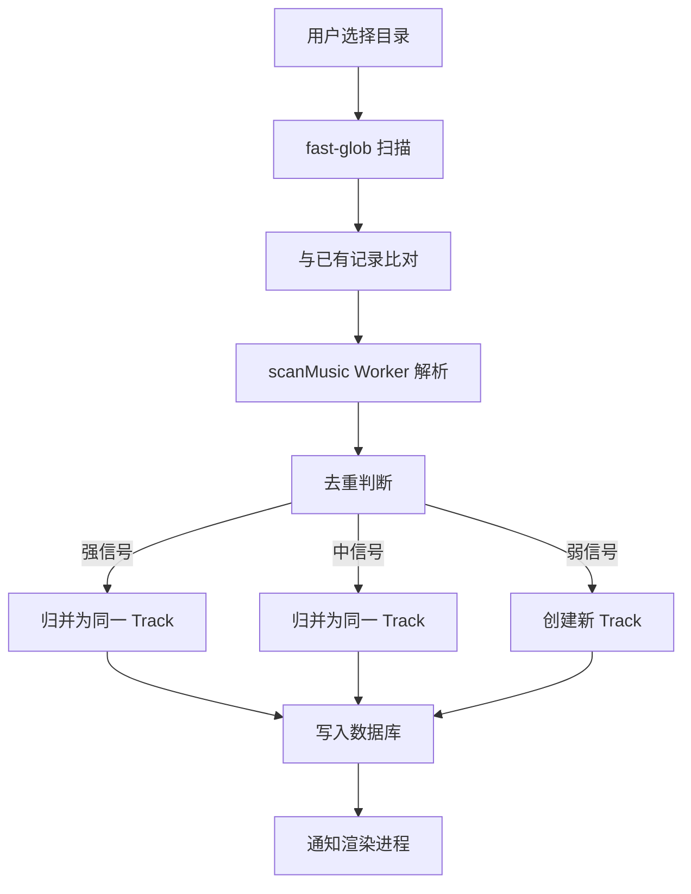
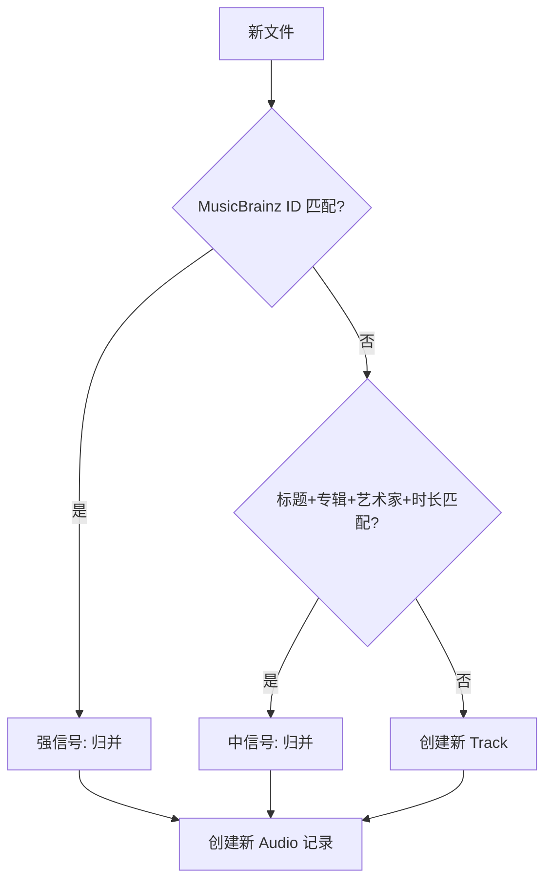

# 本地音乐库

> 数据清理子功能见 [cleanup.md](./cleanup.md)，技术实现见 [Track 数据模型](../../spec/architecture/database/track)。

## 功能概述

本地音乐是 VutronMusic 最基础的音乐来源。用户可能有成百上千的本地音乐文件（FLAC/MP3/WAV 等），需要一套高效的扫描、管理、清理方案。

## 用户故事

| # | 角色 | 故事 | 价值 |
| --- | --- | --- | --- |
| US-1 | 本地音乐用户 | 作为本地音乐用户，我希望扫描目录后自动识别所有音频文件，以便我不需要手动导入 | 自动化管理 |
| US-2 | 收藏家 | 作为收藏家，我希望同一首歌的不同格式/音质版本自动归并，以便我的音乐库整洁有序 | 去重管理 |
| US-3 | CD 翻录用户 | 作为 CD 翻录用户，我希望 CUE 文件自动识别并分轨，以便我可以按歌曲播放 | 无损体验 |
| US-4 | 元数据爱好者 | 作为元数据爱好者，我希望自动匹配在线平台补充歌词和封面，以便我的音乐库信息完整 | 元数据完善 |

## 核心流程

## 验收标准

### 场景 1：扫描本地目录

Given 用户配置了本地音乐目录 When 触发扫描 Then 系统应该：

- 使用 fast-glob 扫描所有音频文件（mp3/flac/wav/m4a 等）
- 与已有记录比对，筛选出新文件
- 使用 Worker 线程池并行解析元数据
- 按去重规则写入数据库

### 场景 2：去重归并

Given 扫描到一首已存在的歌曲（不同格式）When 去重判断 Then 系统应该：

- 如果 MusicBrainz Track ID 一致 → 归并为同一 Track 的新 Audio
- 如果归一化后标题+专辑+艺术家相同且时长误差 ≤ 2s → 归并
- 否则创建独立 Track

### 场景 3：文件删除检测

Given 用户删除了本地音频文件 When 重新扫描 Then 系统应该：

- 检测到文件不存在
- 标记对应 Audio 为 deleted
- 用户可在界面上确认后物理删除

## 去重策略

| 信号强度 | 判断条件                                        | 处理方式                        |
| -------- | ----------------------------------------------- | ------------------------------- |
| 强       | 文件标签内嵌 MusicBrainz Track ID 一致          | 自动归并为同一 Track 的新 Audio |
| 中       | 归一化后标题+专辑+艺术家相同，且时长误差 ≤ 2 秒 | 自动归并为同一 Track 的新 Audio |
| 弱       | 仅部分匹配                                      | 不自动归并，作为独立 Track      |

## 文件变更处理

| 操作         | 策略                                                  |
| ------------ | ----------------------------------------------------- |
| **重新扫描** | 全量扫描，`INSERT OR IGNORE` 写入，已存在数据不受影响 |
| **文件变更** | 同一路径内容不同，需手动更新 Audio 记录               |
| **文件删除** | `clearDeletedMusic` 遍历本地文件，清理不存在的记录    |
| **清除全部** | `deleteLocalMusicDB` 清理所有本地相关记录             |

## 成功指标

| 指标         | 目标          | 衡量方式                       |
| ------------ | ------------- | ------------------------------ |
| 扫描速度     | 5 万首 <60 秒 | 从开始扫描到完成的时间         |
| 去重准确率   | >99%          | 正确归并的比例                 |
| 元数据提取率 | >95%          | 成功提取标题/艺术家/专辑的比例 |

## 不做范围

| 排除项         | 理由                       |
| -------------- | -------------------------- |
| 在线音乐库同步 | 超出本地播放器职责         |
| 音频格式转换   | 保持原文件不变             |
| 自动封面下载   | 依赖插件的 matchTrack 功能 |
