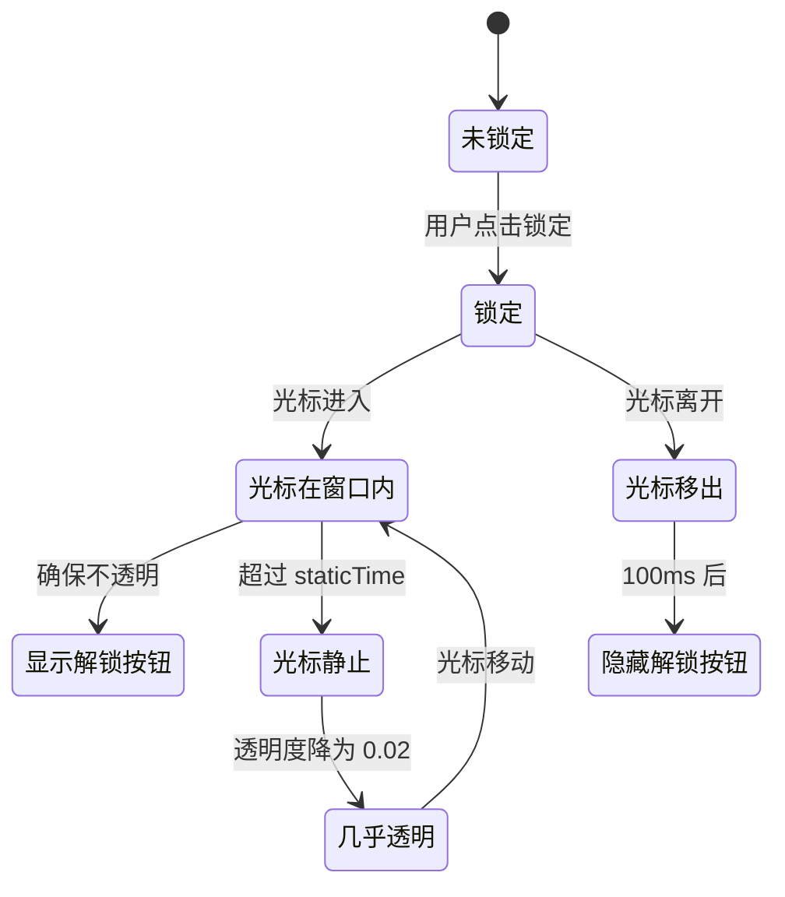

# OSD 歌词

> 技术设计见 [design.md](./design.md)，实现记录见 [dev.md](./dev.md)。

## 功能概述

独立于主窗口的歌词展示窗口，即使主窗口最小化或被遮挡，歌词仍然可见。可拖拽到副屏。

## 用户故事

| # | 角色 | 故事 | 价值 |
| --- | --- | --- | --- |
| US-1 | 多屏用户 | 作为多屏用户，我希望歌词显示在副屏，以便我在主屏工作时也能看到歌词 | 多任务并行 |
| US-2 | 桌面美化用户 | 作为桌面美化用户，我希望歌词窗口可以悬浮在桌面上，以便我随时查看歌词 | 桌面装饰 |
| US-3 | 专注听歌用户 | 作为专注听歌用户，我希望锁定后歌词自动变透明，以便我不被歌词分散注意力 | 减少干扰 |

## 两种模式

| 模式              | 说明                                         |
| ----------------- | -------------------------------------------- |
| **small（mini）** | 单行或双行显示，歌词横向滚动，适合桌面悬浮   |
| **full**          | 完整歌词列表，自动滚动到当前行，适合专注听歌 |

mini 模式下支持两种子模式：

- **oneLine**：始终显示当前行
- **twoLines**：同时显示当前行和下一行

## 验收标准

### 场景 1：锁定后透明度控制

Given 用户锁定 OSD 歌词窗口 When 光标在窗口内静止超过设定时间 Then 窗口透明度应该降为 0.02（几乎透明）

Given 用户锁定 OSD 歌词窗口 When 光标在窗口内移动 Then 窗口应该立即恢复不透明

### 场景 2：双行歌词分组

Given OSD 歌词处于 twoLines 模式 When 连续两句歌词都没有翻译 Then 系统应该将它们合并显示在同一屏

## 锁定交互

| 状态                | 行为                                        |
| ------------------- | ------------------------------------------- |
| 未锁定              | 正常交互，可拖拽、点击                      |
| 锁定 + 光标在窗口内 | 显示解锁按钮，窗口不透明                    |
| 锁定 + 光标移出     | 100ms 后隐藏解锁按钮，恢复不透明            |
| 锁定 + 光标静止     | 超过设定时间后，透明度降为 0.02（几乎透明） |

## 歌词来源

OSD 歌词窗口通过 IPC 从主窗口接收数据，不直接获取歌词。主窗口 watch 播放状态变化后发送 `synchronize-player-info`，主进程转发给 OSD 窗口。

## 成功指标

| 指标         | 目标       | 衡量方式                        |
| ------------ | ---------- | ------------------------------- |
| 数据同步延迟 | <100ms     | 主窗口状态变化到 OSD 更新的时间 |
| 透明度过渡   | 平滑无闪烁 | 光标移动时透明度变化的视觉效果  |
| 内存占用     | <50MB      | OSD 窗口的内存使用量            |

## 不做范围

| 排除项             | 理由                     |
| ------------------ | ------------------------ |
| OSD 窗口内编辑歌词 | 超出播放器职责           |
| OSD 窗口内切换歌曲 | 通过主窗口控制           |
| 独立的歌词搜索     | 复用主窗口的歌词获取逻辑 |
