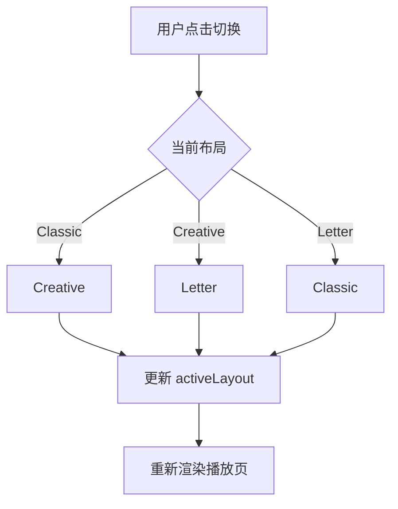
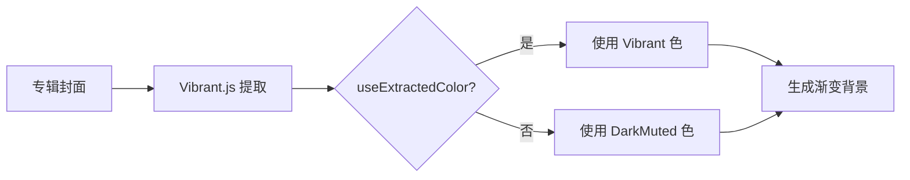

# 播放主题

> 技术设计见 [design.md](./design.md)，实现记录见 [dev.md](./dev.md)。

## 功能概述

播放页面的视觉主题系统，支持三种布局和多种背景类型，用户可自定义并保存主题。

## 用户故事

| # | 角色 | 故事 | 价值 |
| --- | --- | --- | --- |
| US-1 | 个性化用户 | 作为个性化用户，我希望切换不同的播放布局，以便我可以根据心情选择视觉风格 | 个性化体验 |
| US-2 | 视觉爱好者 | 作为视觉爱好者，我希望背景从专辑封面自动提取颜色，以便播放页与音乐风格协调 | 视觉协调 |
| US-3 | 创意用户 | 作为创意用户，我希望歌词有入场动画，以便我可以享受视觉盛宴 | 沉浸体验 |
| US-4 | 收藏用户 | 作为收藏用户，我希望保存自定义主题，以便我下次打开时直接使用 | 持久化偏好 |

## 三种布局

| 布局         | 说明                                                 |
| ------------ | ---------------------------------------------------- |
| **Classic**  | 经典布局：左侧封面 + 右侧歌词，支持封面旋转/圆形样式 |
| **Creative** | 创意布局：全屏背景 + 歌词动画，支持 6 种入场动画     |
| **Letter**   | 信笺布局：扇形封面 + 居中歌词，信笺风格              |

## 验收标准

### 场景 1：切换布局

Given 用户在播放页面 When 点击切换布局按钮 Then 系统应该：

- 在 Classic/Creative/Letter 之间循环切换
- 保留每个布局的独立配置
- 平滑过渡到新布局

### 场景 2：背景颜色提取

Given 用户启用渐变背景 When 播放新歌曲 Then 系统应该：

- 从专辑封面提取主色调
- 生成双色渐变（primary + secondary）
- 平滑过渡到新颜色

### 场景 3：保存自定义主题

Given 用户修改了主题配置 When 点击保存为自定义主题 Then 系统应该：

- 将当前配置深拷贝保存
- 在自定义主题列表中显示
- 下次打开时自动加载

## 10 种背景类型

| 类型          | 说明                                     |
| ------------- | ---------------------------------------- |
| none          | 无背景                                   |
| gradient      | 渐变色（从专辑封面自动提取）             |
| blur-image    | 模糊的专辑封面                           |
| dynamic-image | 动态旋转的专辑封面                       |
| letter-image  | 信笺风格封面                             |
| custom-image  | 用户自定义图片                           |
| custom-video  | 用户自定义视频                           |
| lottie        | Lottie 动画（snow/sunshine）             |
| random-folder | 随机文件夹中的图片/视频                  |
| api           | 从 API 获取的图片（支持按歌曲/定时切换） |

## 主题管理

| 功能       | 说明                         |
| ---------- | ---------------------------- |
| 内置主题   | 经典布局、歌词环游、信笺歌词 |
| 自定义主题 | 基于内置主题修改后保存       |
| 重置主题   | 恢复到内置主题的默认配置     |

## 成功指标

| 指标         | 目标   | 衡量方式                      |
| ------------ | ------ | ----------------------------- |
| 布局切换延迟 | <300ms | 从点击到新布局渲染完成的时间  |
| 颜色提取时间 | <500ms | 从封面加载到渐变生成的时间    |
| 动画帧率     | 60fps  | Creative 布局歌词动画的流畅度 |

## 不做范围

| 排除项                 | 理由           |
| ---------------------- | -------------- |
| 在线主题商店           | 超出播放器职责 |
| 主题导入/导出          | 未来可扩展     |
| 动态主题（随时间变化） | 复杂度过高     |
